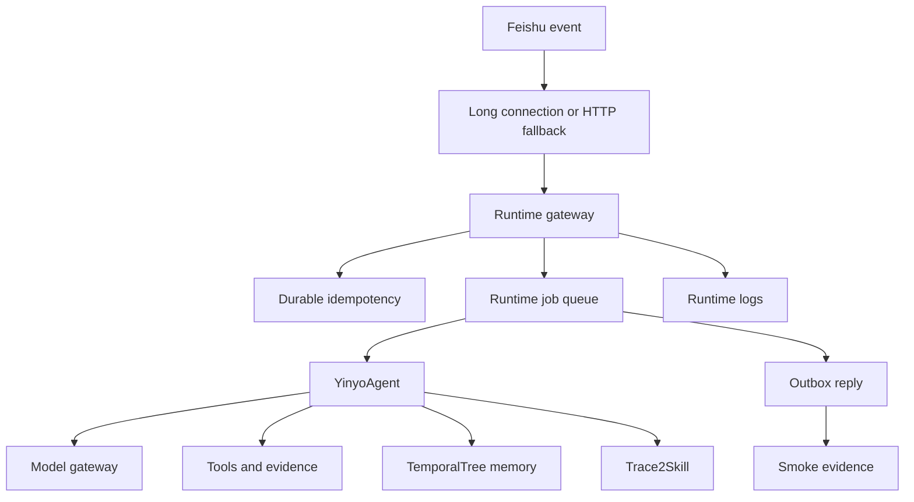

# YINYO Architecture

YINYO is a single-package Python runtime for a Feishu-focused agent. This
document describes the current implementation shape. Capability claims are
governed by [spec.md](spec.md); when this document and the acceptance spec
disagree, the acceptance spec wins.

---

## Runtime Path



The product path is Feishu-only. Long connection is the primary release proof
path; HTTP webhook support remains a tested fallback and local diagnostic path.

---

## Core Components

### Agent Loop

`yinyo/agent.py` orchestrates plan, model, tool, evidence, context, memory, and
reflection behavior.

- Plan phase can produce a step-by-step execution plan.
- The ReAct loop alternates between model output and tool execution.
- Tool results are recorded in evidence before they become claims.
- Reflection can update memory only through validated memory operations.

### Model Gateway

`yinyo/model.py` provides the model-provider boundary.

- DeepSeek is the default product assumption.
- Retry and fallback attempts are observable.
- Run metadata captures provider attempts and usage/cost evidence when
  available.

### Context And Memory

`yinyo/context.py`, `yinyo/memory.py`, and `yinyo/memory_tool.py` implement the
long-context and memory surfaces.

- Recent protected messages stay available during context management.
- Older observations can be masked or summarized.
- Contradictory memory facts supersede earlier facts instead of silently
  coexisting.
- Search excludes superseded facts while audit trails retain them.

### Tools

Built-in tools are registered in `yinyo/tools.py`.

| Tool | Permission | Role |
|---|---|---|
| `do_read` | `ALLOW` | Read workspace files with pagination. |
| `do_write` | `CONFIRM` | Write or overwrite files. |
| `do_search` | `ALLOW` | Search files or file contents. |
| `do_run` | `CONFIRM` | Execute shell commands. |
| `do_ask` | `ALLOW` | Ask a model sub-question. |
| `do_edit` | `CONFIRM` | Apply targeted text edits. |
| `do_patch` | `CONFIRM` | Apply patch-style edits. |
| `do_memory` | `ALLOW` | Manage user/project memory. |
| `do_vision` | `ALLOW` | Analyze images through the vision adapter. |
| `delegate_task` | `ALLOW` | Run a worker agent with shared context. |

Tools marked `CONFIRM` must not run through the agent loop without structured
confirmation metadata: `actor`, tool-scoped `scope`, `reason`, and future
`expires_at`. Legacy `_confirmed` booleans are rejected and recorded as blocked
evidence.

---

## Feishu Runtime

| Component | Role |
|---|---|
| `yinyo/service.py` | Builds runtime config, agent, adapter, gateway, transport, logs, lock, and stores. |
| `yinyo/feishu_ws.py` | Feishu official SDK long-connection transport. |
| `yinyo/feishu_adapter.py` | Feishu API send/download plus HTTP webhook fallback. |
| `yinyo/gateway.py` | Token verification, event normalization, idempotency, job dispatch, and smoke records. |
| `yinyo/jobs.py` | Runtime job lifecycle records. |
| `yinyo/event_store.py` | Durable event idempotency store. |
| `yinyo/outbox.py` | Processing reactions and reply-delivery side effects. |
| `yinyo/runtime_log.py` | Structured JSONL runtime logs. |
| `yinyo/runtime_lock.py` | Single-writer lock for local JSONL stores. |

Local JSONL stores are single-writer. `runtime_lock_path` prevents two local
service processes from writing the same event, job, log, and smoke files. A
same-host stale lock with a dead PID can be recovered; foreign-host or
unparseable locks remain operator blockers.

---

## Evidence

YINYO separates generation from verification wherever practical.

| Evidence | Location |
|---|---|
| Tool evidence | `runs/*/evidence.jsonl` |
| File-change manifests | `runs/*/manifest.json` |
| Runtime logs | `runtime.jsonl` |
| Runtime jobs | `runtime_jobs.jsonl` |
| Event idempotency | `gateway_events.jsonl` |
| Smoke records | `smoke_evidence.jsonl` |
| Redacted release bundle | `yinyo smoke bundle --output <dir>` |

`1.0.0` live smoke records must be backed by matching runtime logs, job records,
event-store records, and advanced live records. Redacted bundles include file
hashes and a stable `bundle_digest`; verification recomputes both.

---

## Release Boundary

Local replay proves product code paths. It does not replace live Feishu
platform evidence.

The final stable-release guard is:

```bash
python scripts/verify_release.py --target 1.0.0 --bundle <bundle-dir> --candidate 1.0.0
```

That command must keep failing until real Feishu long-connection evidence or a
verified redacted bundle exists.
